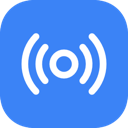

 

# FeeFier - Feed Notifier

**FeeFier** is a simple and privacy-focused feed monitor for your browser that notifies you about new entries in your most important RSS or Atom feeds.

## Features

* **Feed Naming:** Assign descriptive names to your feeds to identify them at a glance.
* **Monitors any Feed:** Works with any valid RSS or Atom feed URL.
* **Customizable Interval:** Set how often the feed should be checked.
* **Individual Toggles:** Pause monitoring for specific feeds anytime without deleting them.
* **Instant Notifications:** Get a desktop notification as soon as an update is found.
* **Badge Indicator:** A badge on the toolbar icon shows you at a glance if there's something new.
* **Dark Mode Support:** Both the options page and the toolbar icon automatically adapt to your browser's light or dark theme.
* **Privacy First:** No data is ever sent to the developer or third parties. All your settings are stored locally or synced securely via your browser account.
* **Multilingual:** User interface is available in multiple languages.

## Installation

You have three options to install FeeFier:

**1. [Chrome Web Store](https://chromewebstore.google.com/detail/feefier-feed-notifier/oebinaipimoikjledbondfpglifplndj)**

**2. [Microsoft Edge Add-ons](https://microsoftedge.microsoft.com/addons/detail/feefier-feed-notifier/kiicjfnkejldenbnfiligmkgldlnglgm)**

**3. Manual Installation (Unpacked)**
1. Clone this repository or download the ZIP and extract it.
2. Open Chrome/Edge and navigate to `chrome://extensions` or `edge://extensions`.
3. Enable **Developer mode** in the top right corner.
4. Click **Load unpacked** and select the src folder.

## Usage

1.  After installation, **right-click** the Feed Notifier icon in your toolbar and select **"Options"**.
2.  Enter the full URL of the feed you want to monitor (e.g., `https://www.tagesschau.de/newsticker.rdf`).
3.  (Optional) Enter a **Name** for the feed to easily identify it in notifications.
4.  Set your desired check interval in minutes (e.g., `15`).
5.  Click **"Save"**.

The extension will now check the feed in the background. If an update is found, a `!` badge will appear on the icon and a system notification will be shown. A **left-click** on the icon clears the badge and triggers a manual check.

## Privacy

Your privacy is a top priority. This extension does not collect, store, or transmit any personal data to the developer or any third parties. All your settings are stored locally or synced securely via your browser account.
[Read full Privacy Policy](PRIVACY.md)

## License

This project is licensed under the MIT License. See the [LICENSE](LICENSE) file for details.
